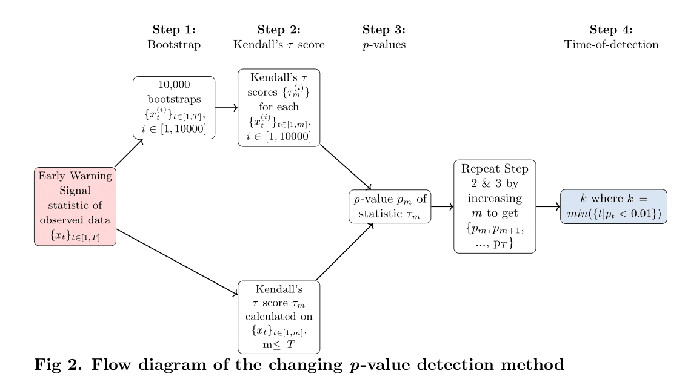

# About

Python files used to implement the changing p-value method, introduced by Harris, 2020

<p align="center">
  
</p>

# How to use

To run analysis to get the p-value time-series, run `run_changing_pvalue.py`. Below is an example bash script demonstrating how to run:

```
#!/bin/bash

for TIME in 20 50 100 250; do
    python run_changing_pvalue.py  ${TIME}
done
```

After, run `pvalue_consecutive.py` to perform the consecutive point constraint. Below is an example bash script demonstrating how to run:
```
#!/bin/bash

python pvalue_consecutive.py
```