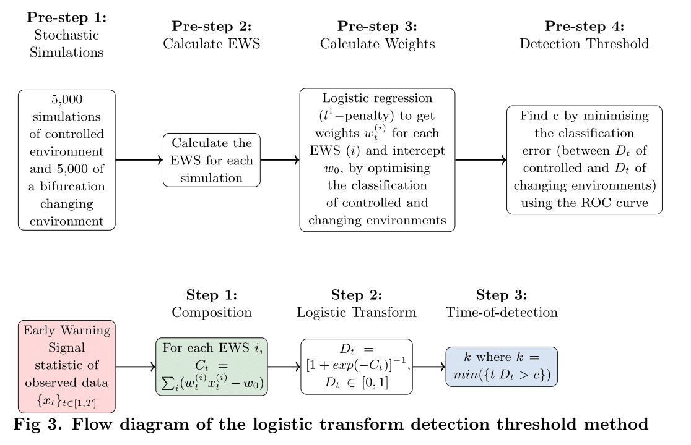

# About

Python files used to implement the Logistic Transform Risk method, introduced by Brett & Rohani, 2021.

The original Python files have been adapated for the disease elimination transition case. The original code from the paper can be found here: https://zenodo.org/record/3713381

  

# How to use

First install the ews package:
`pip install ./py_earlywarnings` [see adaption of ews package here](./py_earlywarnings/README.md)

[Follow for instructions for creating the training datasets](./py/create_training_data/README.md)

[Follow for instructions for training the logistic classifier](./py/training_logistic_classifier/README.md)

[Follow for instructions for testing the logistic classifier and implementing the consecutive point strategy](./py/testing_logistic_classifier/README.md)
