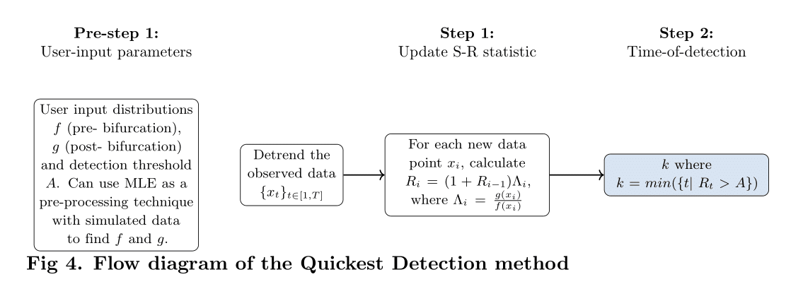

# About

MATLAB files used to implement the Quickest Detection method, introduced by Shiryaev & Roberts, 1961

<p align="center">
  
</p>

# How to use

To run analysis to get the likelihood ratio, run `quickest_detection.m`. Below is an example bash script demonstrating how to run:

```
#!/bin/bash

module load MATLAB/2017a
for STEPS in 2 5 10 25; do

    matlab -nodisplay -nodesktop -nosplash -r "quickest_detection(${STEPS});exit;" 
done
```

After, run `QD_consecutive.py` to perform the consecutive point constraint. Below is an example bash script demonstrating how to run:
```
#!/bin/bash

python QD_consecutive.py
```