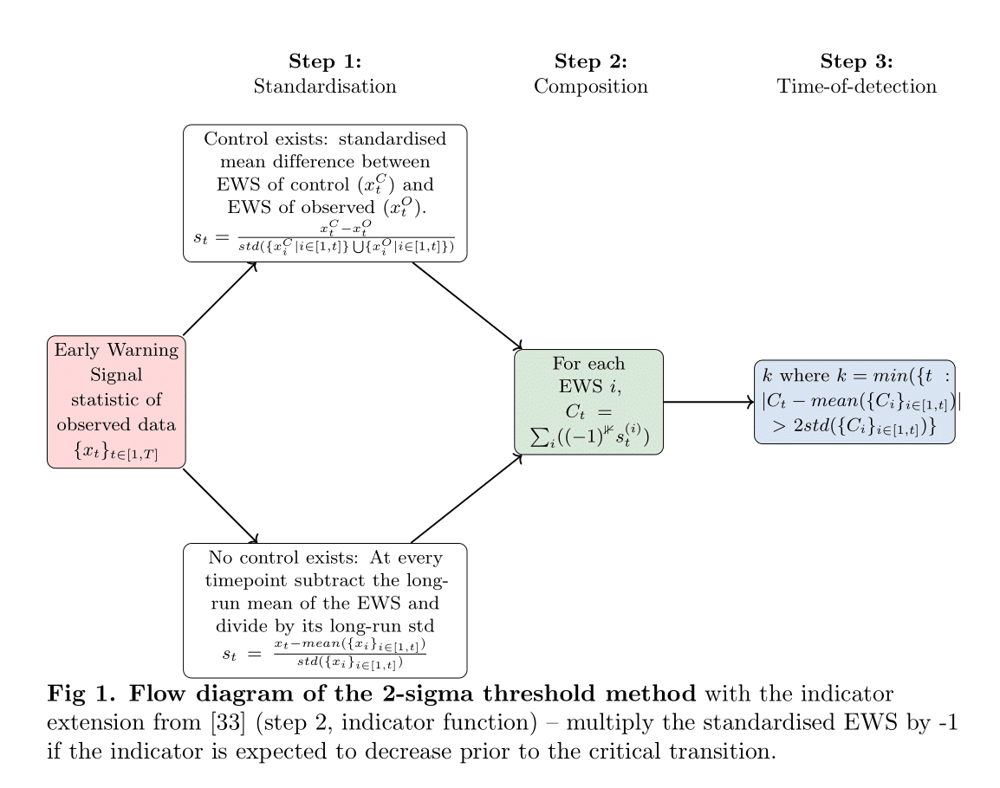

# About

Python files used to implement the 2-sigma method, introduced by Drake & Griffen, 2010. 

<p align="center">
  
</p>


# How to use

To run analysis, run `run_two_sigma_with_consec.py`. Below is an example bash script demonstrating how to run:

```
#!/bin/bash

python run_two_sigma_with_consec.py
```
